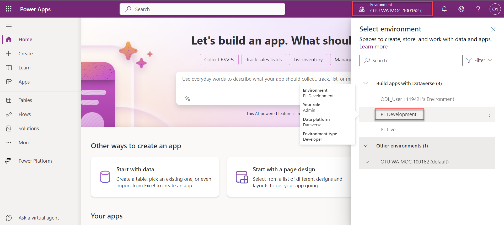
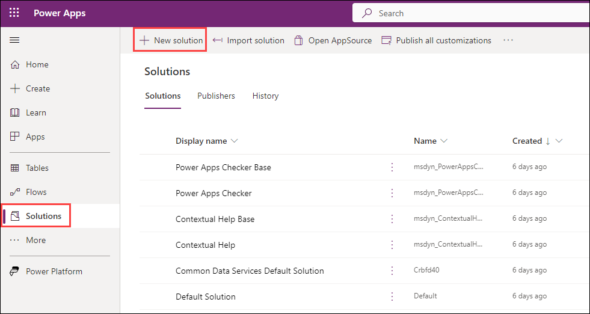
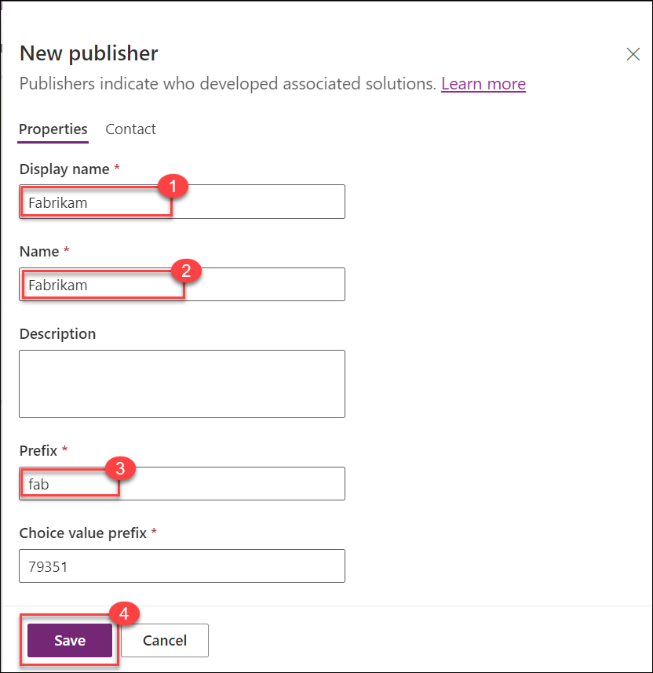
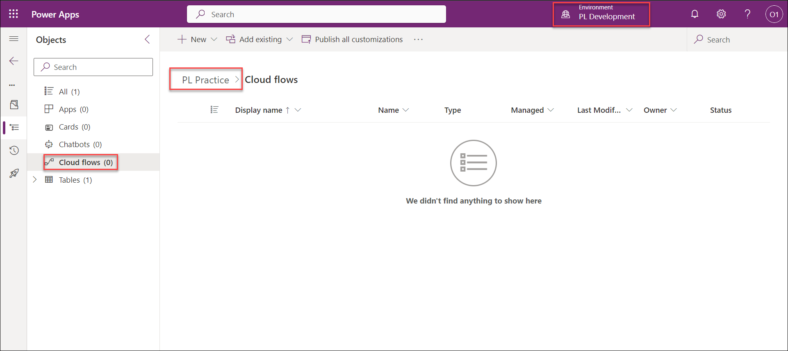
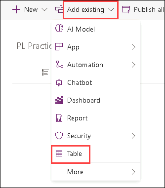
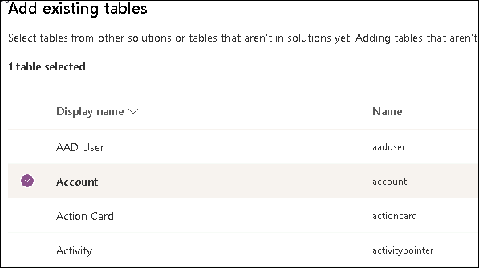
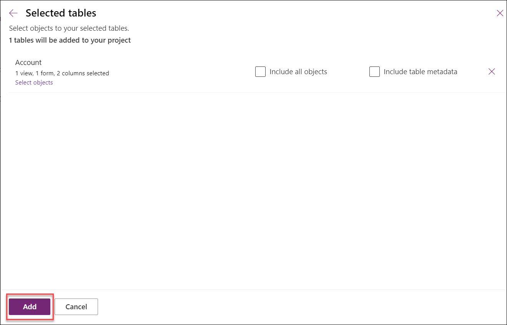

# Module 2 : Lab 1.2 - Publisher and Solution

## Scenario

In this lab, you will create a publisher and a solution.

## Lab objectives
In this lab, you will perform:

+ Exercise 1: Create publisher and solution
+ Exercise 2: Add components to the solution

## Exercise 1 - Create publisher and solution

In this exercise, you will access the Power Apps maker portal, the Development environment and create a new solution.

### Task 1.1 – Maker portal

1. Navigate to the Power Apps Maker portal <https://make.powerapps.com> and sign in with your Microsoft 365 credentials if prompted again.

1. If you are prompted for a **Phone number** enter `0123456789` and select **Submit**.

1. Switch environments by using the Environment Selector in the upper right corner of the screen. The *Contoso (default)* environment will be selected by default.

1. Select your **Development** environment from the list.

    

1. Select **Apps** from the left navigation pane. You should see some default system apps listed, Solution Health Hub etc. You may also see Fabrikam Milestones and Portal Management apps being provisioned.

1. Select **Tables** from the left navigation pane. You should see some recommended tables from the Common Data Model.

### Task 1.2 – Create a publisher

1. Select **Solutions** from the left navigation pane. Click on **New Solution**
    

1. Select the **Publishers** tab.

1. Select **+ New publisher**.

    

1. In the **Display name (1)** text box, enter `Fabrikam`

1. In the **Name (2)** text box, enter `fabrikam`

1. In the **Prefix (3)** text box, enter `fab`

1. Select **Save (4)**.

   

### Task 1.3 – Create a solution

1. Select the **Solutions** tab.

1. Select **+ New solution**.

1. In the **Display name** text box, enter **[my initials] Practice solution** (Example : PL Practice). The Name text box should be automatically populated.

1. In the **Publisher** drop-down, select **Fabrikam**.

1. Select **Create**.

   

## Exercise 2 - Add components to the solution

In this exercise, you will access the Power Apps maker portal and select the **Development** environment.

### Task 2.1 – Add table

1. Navigate to the Power Apps Maker portal <https://make.powerapps.com>.

1. Make sure you are in the Development environment.

1. Select **Solutions**.

1. Select the **Practice solution** you created in the previous exercise.

    

1. Select **Add existing** and choose **Table**.

    

1. Select the **Account** table.

    

1. Select **Next**. 

1. Under the **Account** table, select the **Select objects** link.

1. In the **Columns** tab, select the **Account Number** column.

1. Select the **Views** tab.

1. Select the **Active Accounts** view.

1. Select the **Forms** tab.

1. Select the **Account** form.

1. Select **Add**.

    > **Note:** You should have selected 1 view, 1 form, and 1 column for the **Account** table.

1. Select **Add**.
   
     

### Review
In this lab, you created publisher and solution and also added components to the solution.
