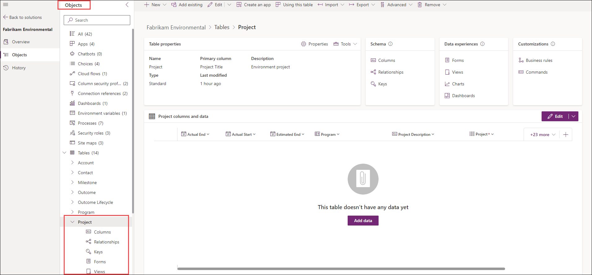
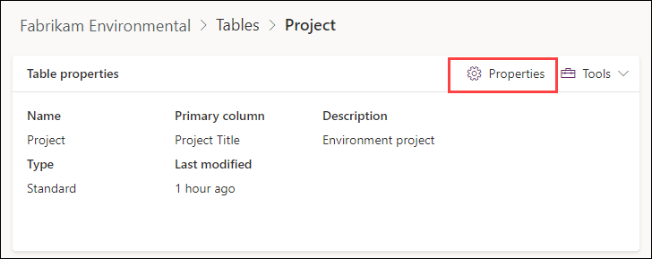
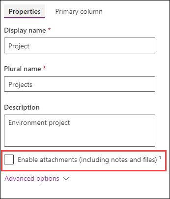
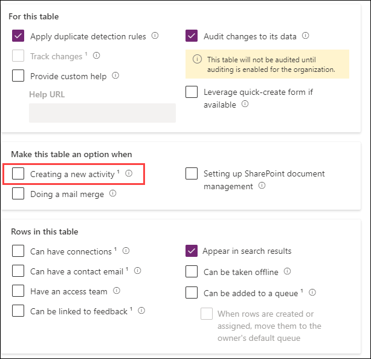

# Practice Lab 1.4 – Tables

## Scenario

You are a Power Platform functional consultant and have been assigned to the Fabrikam project for the next stage of the project.

You need to familiarize yourself with the data model and then make changes to tables and their properties for this phase of the project.

> This file (Fabrikam Environmental Data Model.png) is located in the Documents\PL-200 folder on your machine.

In this practice lab, you will be modifying table properties and creating a new custom table.

## Exercise 1 – Explore the data model

In this exercise, you will be examining the tables in the Fabrikam Environmental solution. Take some time to familiarize yourself with your client, Fabrikam's, data model and existing business rules. 

### Task 1.1 – Examine tables

1.  Navigate to the Power Apps Maker portal `https://make.powerapps.com`

1.  Make sure you are in your **Development** environment.

1.  Select **Solutions**.

1.  Open the **Fabrikam Environmental** solution.

1.  In the **Objects** pane on the left, expand **Tables**.

1.  Select the **Project** table.

    

1.  Under **Schema**, select **Columns**. You will see columns including Project Title, Project Type, Estimated End, and Program.

1.  In the **Objects** pane on the left, select **Relationships**. You will see multiple One-to-many, Many-to-one, and a many-to-many relationships.

1.  Expand the **Milestone** table and examine its columns and relationships.

1.  Expand the **Project Funding** table and examine its columns and relationships.

1.  Select **Business rules** under the **Project Funding** table. There is a rule for the funding percentage. Open the business rule and examine how it works. 

1.  Close the business rule and select **Done**. 

1.  Expand the **Project Resource** table and examine its columns and relationships.

## Exercise 2 – Change table properties

In this exercise, you will be updating the properties on the Project table to allow users to add attachments and use activities with project records. You will also enable audit and other search on other tables in the solution.

### Task 2.1 – Enable attachments and activities on the project table

1.  Navigate to the Power Apps Maker portal `https://make.powerapps.com`

1.  Make sure you are in the **Development** environment.

1.  Select **Solutions**.

1.  Open the **Fabrikam Environmental** solution.

1.  In the **Objects** pane on the left, expand **Tables**.

1.  Select the **Project** table.

1.  Select **Properties**.

    

    > **Note:** If Properties is not shown, maximize your browser and/or zoom in until Properties appears.

1.  In the **Edit table** pane that appears on the right-hand side of the screen, check the **Enable attachments (including notes and files)** box.

    

1.  Expand **Advanced options** and scroll down.

1.  Check the **Creating a new activity** box.

    

1.  Select **Save**.

### Task 2.2 – Enable audit and search on the Milestone table

1.  Select the **Milestone** table.

1.  Select **Properties**.

1.  In the **Edit table** pane that appears on the right-hand side of the screen, expand **Advanced options** and scroll down.

1.  Check the **Audit changes to its data** box.

1.  Check the **Appear in search results** box.

1.  Select **Save**.

### Task 2.3 – Enable audit on the Outcome table

1.  Select the **Outcome** table.

1.  Select **Properties**.

1.  In the **Edit table** pane that appears on the right-hand side of the screen, expand **Advanced options** and scroll down.

1.  Check the **Audit changes to its data** box.

1.  Select **Save**.

### Task 2.4 – Enable audit on the Project Funding table

1.  Select the **Project Funding** table.

1.  Select **Properties**.

1.  In the **Edit table** pane that appears on the right-hand side of the screen, expand **Advanced options** and scroll down.

1.  Check the **Audit changes to its data** box.

1.  Select **Save**.

## Exercise 3 – Create a custom table

In this exercise, you will be creating a new custom table named Project Outcome. This table will link outcomes to projects. Currently there is a many-to-many relationship between Project and Outcome. This table will be used in place of this relationship.

In later labs you will be adding columns and relationships to this custom table.

### Task 3.1 – Create custom table

1.  In the **Objects** pane on the left, select **Tables**.

1.  Select the **+ New** drop-down and select **Table** then **Table**.

      

1.  Enter `Project Outcome` for **Display Name**. The plural name will be automatically populated.

1.  Enter `Environmental outcomes for a project` for **Description**.

1.  Expand **Advanced options**.

1.  Uncheck the **Apply duplicate detection rules** box.

1.  Uncheck the **Doing a mail merge** box.

1.  Check the **Audit changes to its data** box.

1.  Scroll up, and select the **Primary column** tab.

1.  Enter `Title` for **Display Name**.

1.  Expand **Advanced options**.

1.  Change the **Column requirement** drop-down to **Optional**.

1.  Change the **Maximum character count** to **200**.

1.  Select **Save**.
   
   > **Congratulations** on completing the task! Now, it's time to validate it. Here are the steps:
> - Click the (...) icon located at the upper right corner of the lab guide section and navigate to the Lab Validation Page.
> - Hit the Validate button for the corresponding task.If you receive a success message, you can proceed to the next task. 
> - If not, carefully read the error message and retry the step, following the instructions in the lab guide.
> - If you need any assistance, please contact us at labs-support@spektrasystems.com. We are available 24/7 to help you out.

### Task 3.2 – Publish changes

1.  In the solution select the **Overview** page.

    

1.  Select **Publish all customizations**.

