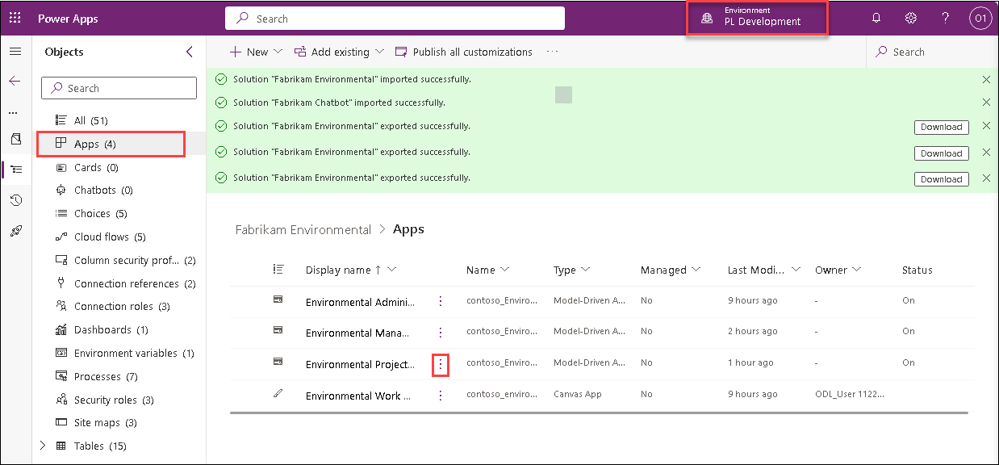
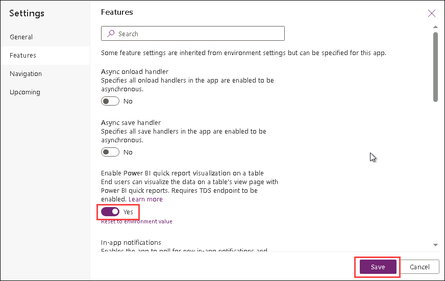

# Module 3 : Lab 3.3 – Dashboards

## Scenario

You are a Power Platform functional consultant and have been assigned to the Fabrikam project for the next stage of the project.

In this practice lab, you will be creating an interactive dashboard and adding it to a Fabrikam Environment model-driven app.

## Lab objectives
In this lab, you will perform:

+ Exercise 1: Configuring Dashboard security
+ Exercise 2: Create an interactive dashboard
+ Exercise 3: Enable Power BI quick reports
+ Exercise 4: Import and export solution

## Exercise 1 – Dashboard security

In this exercise, you will assign security roles to the existing dashboard.

### Task 1.1 – Assign roles to dashboard

1. Navigate to the Power Apps Maker portal `https://make.powerapps.com`

1. Make sure you are in the **Development** environment.

1. Select **Solutions**.

1. Open the **Fabrikam Environmental** solution.

1. In the **Objects** pane on the left, select **Dashboards**. You should see a single dashboard.

1. Select the **Environmental Results** dashboard (do not open it) and select **Enable security roles**.

1. Select the **Display only to these security roles** radio button.

1. Deselect all security roles.

1. Select the following security roles:

    - Environmental user
    - System Administrator
    - System Customizer

1. Select **OK**.

1. Select **Publish**.

## Exercise 2 – Create an interactive dashboard

In this exercise, you will create an interactive dashboard for Projects.

### Task 2.1 – Create a dashboard

1. Navigate to the Power Apps Maker portal `https://make.powerapps.com`

1. Make sure you are in the **Development** environment.

1. Select **Solutions**.

1. Open the **Fabrikam Environmental** solution.

1. In the **Objects** pane on the left, expand **Tables**.

1. Select the **Project** table.

1. Under **Data experiences**, select **Dashboards**.

1. Select **+ New Dashboard** > **2-Column overview**

1. Enter `Project Tracking` for **Name**.

1. Select **Scheduled End** in the **Filter By** drop-down.

1. Select **This Quarter** in the **Time Frame** drop-down.

1. In the first pane under **Visual Filters**, select the chart icon.

1. Select the **Projects by Status and Type** chart and select **Add**.

1. In the **Streams** pane, select the stream icon.

    

1. Select the **My Active Projects** view and select **OK**.

1. In the toolbar, select **Stream**.

1. Select the **Active Projects** view and select **OK**.

1. In the toolbar, select **Stream**.

1. Select the **Completed Projects** view and select **OK**.

1. Select **Save**.

1. Select **Close**.

1. Select **Done**.

1. In the **Objects** pane on the left, select **All**.

1. Select **Publish all customizations**.

## Exercise 3 – Enable Power BI quick reports

In this exercise, you will be enabling the feature that uses Power BI to create a report from a model-driven app view.

### Task 3.1 – Environmental Project Delivery app settings

1. Navigate to the Power Apps Maker portal `https://make.powerapps.com`

1. Make sure you are in the **Development** environment.

1. Select **Solutions**.

1. Open the **Fabrikam Environmental** solution.

1. In the **Objects** pane on the left, expand **Apps**.

1. Select the **Environmental Project Delivery** app, click on the ellipses (...), and select **Edit** > **Edit in new tab**.

   

1. In the action bar, select **Settings**.

1. Select **Features**.

1. Toggle **Enable Power BI quick report visualization on a table** to **Yes**.

   

1. Select **Save**.

1. Select **Publish**.

1. Select **Play**. Explore the Environmental Project Delivery app. 

1. **Close** the app and the app designer tabs.

1. Select **Done**.

## Exercise 4 – Solutions

In this exercise, you will export the solution from the Development environment and import it into the Live environment.

### Task 4.1 – Export managed solution

1. Navigate to the Power Apps Maker portal `https://make.powerapps.com`

1. Make sure you are in the **Development** environment.

1. Select **Solutions**.

1. Select the **Fabrikam Environmental** solution row but do not open it.

1. Select **Export solution**.

1. Select **Next**.

1. The version number should have been incremented to **1.1.11.8**.

1. Select **Managed** for **Export As**.

1. Select **Export**.

1. The export will be prepared in the background. When the solution is ready, select the **Download** button.

### Task 4.2 – Export unmanaged solution

1. Select the **Fabrikam Environmental** solution.

1. Select **Export solution**.

1. Select **Next**.

   

1. The version number should have been incremented to **1.1.11.9**.

1. Select **Unmanaged** for **Export As**.

1. Select **Export**.

1. The export will be prepared in the background. When the solution is ready, select the **Download** button.

### Task 4.3 – Import managed solution

1. Switch environments by using the **Environment Selector** in the upper right corner of the Maker portal.

1. Select the **Live** environment from the list.

1. Select **Solutions**.

1. Select **Import solution**.

1. Select **Browse**,  change to the **Downloads** folder and select **FabrikamEnvironmental_1_1_11_8_managed.zip** and select **Open**.

1. Select **Next**.

1. Select **Import**. The solution will import in the background.

### Review
In this lab, you configured dashboard security, created an interactive dashboard, enabled Power BI report, imported and exported solution.
